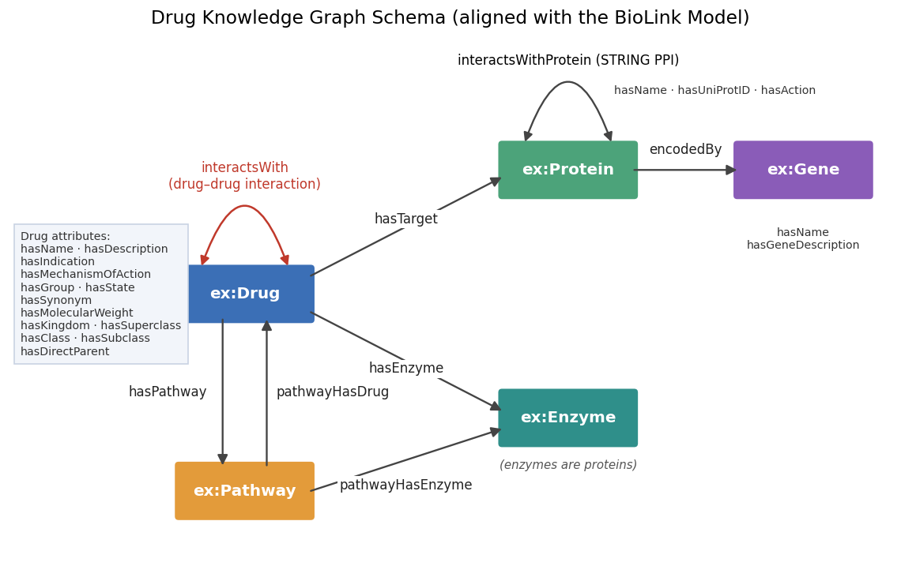
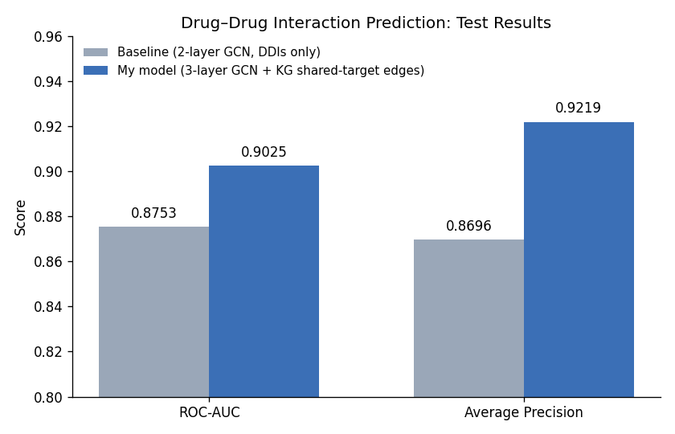

# Drug–Drug Interaction Knowledge Graph and GNN Prediction

A two-part project that builds a **biomedical knowledge graph** of drugs, proteins, genes and pathways, queries it with **SPARQL**, and uses it to improve a **Graph Neural Network (GNN)** that predicts **drug–drug interactions (DDIs)**.

Completed for the *Knowledge-based Artificial Intelligence* module at university.

| Result | Baseline GNN | My GNN + Knowledge Graph |
|---|---|---|
| ROC-AUC | 0.8753 | **0.9025** (+0.027) |
| Average Precision | 0.8696 | **0.9219** (+0.052) |

---

## Why This Matters

Taking two drugs together can cause harmful interactions. Testing every pair in a lab is impossible, but many interactions can be explained by biology, for example two drugs acting on the same protein. This project links drug data from several biomedical databases into one **knowledge graph**, then uses that biological context to help a neural network **predict unknown drug–drug interactions**.

## Part 1 – Building the Knowledge Graph

### ETL Pipeline (`strategies.py`)
An **extract–transform–load pipeline** built with **RDFLib** fetches data from several biomedical sources and converts it into RDF triples. It is split into four strategies, each adding a new layer to the graph:

| Strategy | What it adds | Sources |
|---|---|---|
| `drug_core` | Drugs with name, description, indication, mechanism of action, groups, state, synonyms, molecular weight, and known **drug–drug interactions** | DrugBank |
| `drug_mechanisms` | **Target proteins**, their actions (e.g. inhibitor), and the **genes** that encode them | DrugBank, UniProt, MyGene |
| `drug_biological_context` | **Pathways** the drug takes part in, and the **enzymes** that metabolise it | SMPDB, DrugBank |
| `drug_network_context` | **Protein–protein interactions** between targets, and each drug's **chemical classification** (kingdom → superclass → class → subclass → direct parent) | STRING, DrugBank (ClassyFire taxonomy) |

### Ontology / Schema (`drug_schema.ttl`)
The graph follows a custom RDFS schema aligned with the **BioLink Model**, a standard vocabulary for biomedical knowledge graphs. Each class and property is mapped to its BioLink equivalent, for example `ex:Drug ⊑ biolink:Drug` and `ex:hasTarget ⊑ biolink:interacts_with`.



## Part 2 – Semantic Search with SPARQL

I answered **21 competency questions** of increasing difficulty with SPARQL queries over the graph:

- **Easy:** drug profiles, synonyms, filtering by group, molecular weight or chemical kingdom
- **Moderate:** proteins targeted by more than 3 drugs, unique interacting drug pairs, average molecular weight per kingdom
- **Challenging:** multi-hop queries, for example *"drugs whose target protein also interacts with an enzyme of the same drug"*, *"genes that encode enzymes but never drug targets"*, and *"other enzymes in the same pathway that don't act on the drug directly"*

These use techniques including `OPTIONAL`, `FILTER NOT EXISTS`, `GROUP BY` / `HAVING`, aggregation, subqueries and named graphs.

👉 All queries are in [`sparql_queries.md`](sparql_queries.md).

## Part 3 – GNN for Drug–Drug Interaction Prediction (`gnn.py`)

DDI prediction is treated as **link prediction**: given two drugs, predict whether an interaction edge should exist between them. The model is built with **PyTorch Geometric**.

### Baseline (`basic_ddi_gnn`)
- 2 GCN layers, with one-hot (identity) node features
- Graph edges: known DDIs only
- Decoder: dot product of the two drug embeddings

### My model (`my_ggn_model`)
- **3 GCN layers** (64 hidden units) with ReLU and **dropout (0.3)**
- **Knowledge-graph enrichment:** a SPARQL query over the knowledge graph finds pairs of drugs that **share a protein target**, and these are added as extra edges
- Dot-product decoder, `BCEWithLogitsLoss`, Adam optimiser (learning rate 0.01, 50 epochs)
- `RandomLinkSplit` with 80/10/10 train/validation/test split and 1:1 negative sampling

```sparql
SELECT ?d1 ?d2 WHERE {
    ?d1 ex:hasTarget ?protein .
    ?d2 ex:hasTarget ?protein .
    FILTER(?d1 != ?d2)
}
```

### Results



Adding knowledge-graph edges improved **ROC-AUC by 2.7 points** and **Average Precision by 5.2 points**. Drugs acting on the same protein often interact, so these edges give the GNN a useful biological signal that the interaction data alone doesn't have.

### Limitations and Next Steps
- The shared-target edges were added to the graph *before* the train/test split, so some test pairs are shared-target links rather than confirmed interactions. A cleaner setup would use these edges only for message passing and evaluate only on real DDIs.
- No random seed was fixed, so scores can vary slightly between runs.
- The model uses only drug nodes. A **heterogeneous GNN** (for example R-GCN) that uses proteins, genes and pathways directly could capture richer biology.

## Repository Files
| File | Description |
|---|---|
| `strategies.py` | ETL strategies that populate the knowledge graph |
| `drug_schema.ttl` | RDFS ontology aligned with the BioLink Model |
| `sparql_queries.md` | 21 SPARQL competency queries with explanations |
| `gnn.py` | Baseline and knowledge-graph-enhanced GNN models for DDI prediction |

> These files plug into an ETL and GNN framework (`etl_core`) and datasets that were provided by the university, so they are not included here.

## Tech Stack
Python · RDFLib · RDF / RDFS · SPARQL · BioLink Model · GraphDB · PyTorch · PyTorch Geometric · Scikit-learn · Pandas
